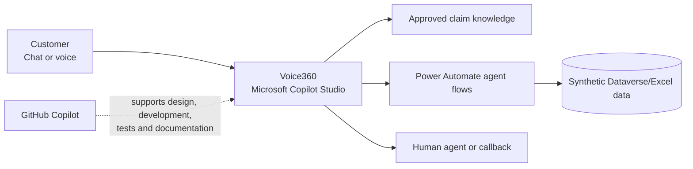
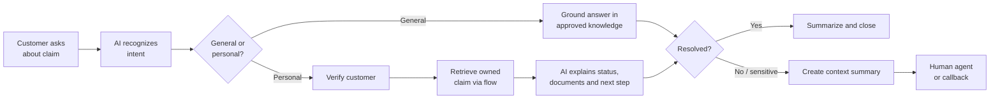

# Five-Slide Presentation Inputs

Prepared for Harsh. Keep the final deck executive, visual, and limited to five slides. Use screenshots from the actual working agent and label simulated integrations clearly.

## Slide 1: Context and Why Now

**Title:** Insurance servicing must move from queues to conversations

**Challenges and impact**

- Customers wait in call queues for routine questions such as claim status and missing documents.
- Rigid IVR menus do not understand context or complete servicing actions.
- Contact-center teams face rising demand, cost pressure, talent constraints, and turnover.
- Repeated authentication and explanations create frustration for customers and agents.

**Strategic imperative**

- Customers expect immediate, natural, always-available service.
- Human capacity should focus on sensitive and complex cases.
- Generative AI plus controlled automation can combine conversation, knowledge, and action.

**Shift in operating model**

> From queue-based, agent-only servicing to AI-assisted self-service with humans handling judgment and exceptions.

**Suggested visual:** Before/after split: long queue and IVR tree on the left; direct conversation and contextual human handoff on the right.

## Slide 2: Current Challenges and Gaps

**Title:** Routine claim enquiries consume time but still deliver a fragmented experience

**Current flow**

1. Customer calls the insurer.
2. Customer navigates a menu and waits.
3. Agent repeats identity questions.
4. Agent searches multiple systems.
5. Agent explains the claim status.
6. Customer repeats context if transferred.

**Key gaps**

- High manual effort for repeatable enquiries.
- Long wait and handling times.
- Inconsistent explanations of claim stages.
- Limited 24/7 servicing.
- Weak context transfer between automation and people.
- Traditional automation can route but cannot safely retrieve and explain individualized status.

**Suggested visual:** A six-step current-state journey with wait icons at steps 2, 4, and 6.

Do not insert invented cost, call-volume, or satisfaction figures. Use qualitative impact unless the team has a cited dataset.

## Slide 3: Vision and Future State

**Title:** Voice360 resolves routine needs and brings people in at the right moment

**What the MVP enables**

- Natural-language claim assistance.
- Approved, consistent answers to common questions.
- Secure retrieval of an existing claim after verification.
- Clear missing-document and next-step guidance.
- Callback creation and contextual human escalation.

**Expected strategic outcomes**

- Faster answers and reduced customer effort.
- Lower routine demand on contact-center agents.
- More consistent servicing.
- Shorter handoff time because context travels with the customer.
- Greater human focus on exceptions, vulnerability, complaints, and decisions.

**Future operating model**

| AI handles | People handle |
|---|---|
| Intent recognition, approved FAQs, data retrieval, summarization, routine callback creation | Judgment, coverage and liability decisions, complaints, vulnerability, fraud, legal and complex cases |

**Suggested visual:** Customer at the center, Voice360 on the routine path, human specialist on the exception path.

## Slide 4: Solution Overview

**Title:** A grounded Copilot Studio agent with controlled actions and human guardrails

**Key capabilities**

- Generative orchestration selects appropriate knowledge, topics, and actions.
- Approved knowledge grounds general responses.
- Deterministic flows enforce verification and claim ownership.
- Confirmation protects write actions.
- Escalation carries a structured summary.

**AI tools**

- Microsoft Copilot Studio: conversational agent and orchestration.
- GitHub Copilot: requirements refinement, flow/code assistance, test generation, security review, and documentation—include only uses recorded in the evidence log.

**Suggested visual:** Recreate the architecture with product icons; add a small “synthetic data” label.

## Slide 5: Business Flow and Role of AI

**Title:** One end-to-end journey from question to resolution or contextual handoff

**AI intervention points**

1. Intent recognition and conversational slot collection.
2. Retrieval from approved knowledge.
3. Selection of verified actions.
4. Plain-language explanation of returned status.
5. Handoff summarization.

**Control points**

- Verification before disclosure.
- Claim ownership checked inside the action.
- No AI claim decisions.
- Explicit confirmation before callback creation.
- Mandatory escalation for sensitive cases.

**Close:** “Voice360 makes routine servicing immediate while keeping consequential insurance decisions with people.”

## Speaker-note assignments

| Slide | Suggested speaker | Key message |
|---|---|---|
| 1 | Pulkit | Business urgency and operating-model shift |
| 2 | Harsh | Current customer and agent pain points |
| 3 | Harsh | Future-state experience and benefits |
| 4 | Rohit | Copilot Studio build and GitHub Copilot usage |
| 5 | Pulkit | End-to-end flow, guardrails, and close |

## Screenshot list

- Voice360 welcome/conversation starters.
- Grounded explanation of “under review.”
- Successful `CLM-1042` response.
- Callback confirmation/reference.
- Handoff summary.
- Copilot Studio topics/actions page.
- GitHub Copilot evidence and repository artifacts.

## Claims to avoid

Do not claim:

- A measured cost saving without evidence.
- A production-grade authentication implementation.
- A working phone transfer if only chat was demonstrated.
- Production readiness.
- GitHub Copilot activities that were not performed and logged.
- That AI approves, denies, or adjudicates claims.

