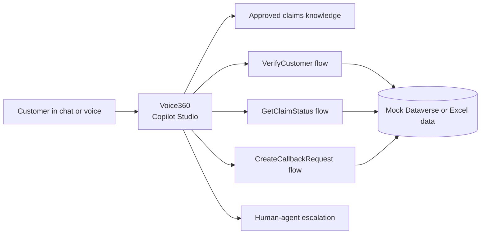

# Voice360 Capstone Agent Build Pack

Version: 1.0  
Prepared: 13 August 2026  
Submission deadline: 18 August 2026

## Purpose

This folder contains the material needed to build and demonstrate the Voice360 capstone in Microsoft Copilot Studio. Voice360 is a proof-of-concept conversational servicing agent for a fictional personal motor insurer, Contoso Assurance.

The MVP supports one complete customer journey:

1. Answer general motor-claim questions from approved content.
2. Verify a customer using fictional data.
3. Retrieve the customer's claim status through an action.
4. Explain missing documents and the next step.
5. Create a callback or hand the conversation to a human with context.

No file in this pack contains real customer or company data.

## Handoff map

| File | Owner/use |
|---|---|
| [01-agent-brief.md](01-agent-brief.md) | Team agreement on scope, users, outcomes, and acceptance criteria |
| [02-copilot-studio-build-guide.md](02-copilot-studio-build-guide.md) | Rohit's step-by-step implementation checklist |
| [03-agent-instructions.md](03-agent-instructions.md) | Paste-ready name, description, and agent instructions |
| [04-insurance-knowledge-base.md](04-insurance-knowledge-base.md) | Upload this file as the agent's approved knowledge source |
| [05-conversation-and-topic-design.md](05-conversation-and-topic-design.md) | Topics, variables, routing logic, and example conversations |
| [06-actions-and-power-automate-contracts.md](06-actions-and-power-automate-contracts.md) | Contracts for verification, claim lookup, callback, and escalation actions |
| [07-security-guardrails-and-escalation.md](07-security-guardrails-and-escalation.md) | Privacy, safety, action boundaries, and handoff policy |
| [08-test-plan.md](08-test-plan.md) | Test approach, exit criteria, and defect tracking |
| [09-demo-script.md](09-demo-script.md) | Five-minute showcase script and contingency plan |
| [10-github-copilot-evidence.md](10-github-copilot-evidence.md) | Prompt/evidence log required to demonstrate GitHub Copilot use |
| [11-presentation-inputs.md](11-presentation-inputs.md) | Five-slide content and speaker-note pointers for Harsh |
| [data/customers.csv](data/customers.csv) | Fictional customers; import into Dataverse or an Excel table |
| [data/claims.csv](data/claims.csv) | Fictional claims; import into Dataverse or an Excel table |
| [data/callbacks.csv](data/callbacks.csv) | Empty callback table with one example record |
| [data/test-cases.csv](data/test-cases.csv) | Executable UAT checklist |

## Fastest implementation path

For the capstone, use Microsoft Copilot Studio with generative orchestration and Power Automate agent flows.

Use `04-insurance-knowledge-base.md` only for general information. Do not upload `customers.csv`, `claims.csv`, or `callbacks.csv` as knowledge. Import those files into Dataverse or Excel and access them through authenticated actions. Uploaded Copilot Studio knowledge is available to anyone who can chat with the agent.

## Recommended team split

| Person | Responsibility |
|---|---|
| Pulkit | Product scope, architecture, action/data contracts, guardrails, GitHub repository, integration support |
| Rohit | Copilot Studio agent, topics, Power Automate flows, agent testing, publishing |
| Harsh | Five-slide presentation, visual design, screenshots, and frontend/demo support |

## Definition of done

- The agent answers an approved FAQ without inventing information.
- The claim-status journey works for `CLM-1042` after successful verification.
- Incorrect verification never reveals whether a policy or claim exists.
- Claim-specific information comes from an action, not the knowledge file.
- Missing documents and the next step are explained clearly.
- Callback creation returns a reference number.
- Explicit requests for a person trigger escalation.
- At least the critical tests in `data/test-cases.csv` pass.
- GitHub Copilot usage evidence is captured honestly.
- The five-slide presentation and demo are ready.

## Microsoft references

- [Write agent instructions](https://learn.microsoft.com/en-us/microsoft-copilot-studio/authoring-instructions)
- [Configure high-quality instructions](https://learn.microsoft.com/en-us/microsoft-copilot-studio/guidance/generative-mode-guidance)
- [Use uploaded files with generative answers](https://learn.microsoft.com/en-us/microsoft-copilot-studio/nlu-documents)
- [Hand off to a live agent](https://learn.microsoft.com/en-us/microsoft-copilot-studio/advanced-hand-off)
- [Use interactive voice response](https://learn.microsoft.com/en-us/microsoft-copilot-studio/voice-overview)

